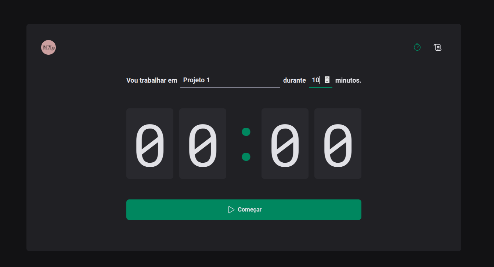
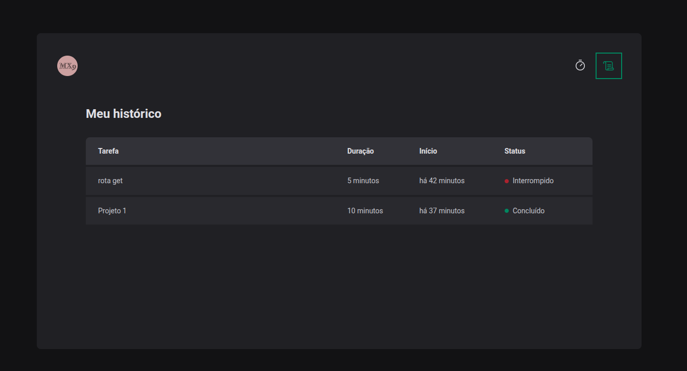

# ⏳ Pomodoro Timer

Aplicação web desenvolvida em **React** com **TypeScript**, inspirada na técnica Pomodoro, que ajuda a manter o foco e a produtividade.

---

## 🚀 Tecnologias utilizadas

- **React** + **TypeScript**
- **Styled Components** – estilização baseada em componentes
- **Redux** – gerenciamento de estado global
- **React Hook Form** – manipulação de formulários
- **Zod** – validação de dados
- **React Router DOM** – navegação entre páginas

---

## 📋 Funcionalidades

- Criar tarefas com tempo estimado entre **5 e 60 minutos**
- Timer que inicia automaticamente após criar a tarefa
- Opção para **interromper o timer** a qualquer momento
- Histórico de todas as tarefas criadas, com status e duração
- Interface intuitiva

---

## 🖼️ Demonstração

**Tela inicial – Criação de tarefa**  


**Histórico de tarefas**  


---

site: https://timer-pomodoro-iota.vercel.app

## 📦 Como executar o projeto

```bash
# Clone o repositório
git clone https://github.com/Marvinx9/timer-pomodoro.git

# Acesse a pasta do projeto
cd timer-pomodoro

# Instale as dependências
npm install

# Execute o projeto
npm run dev
```
